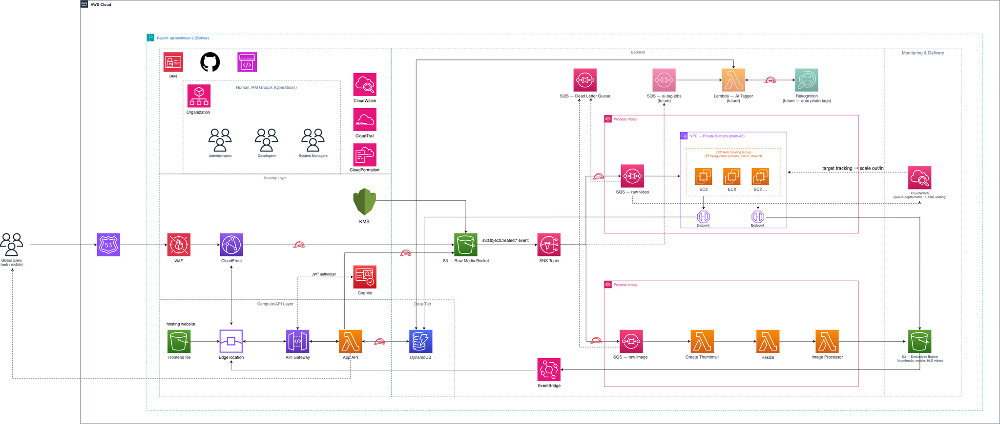

# PhotoAlbum — Serverless Event-Driven Media Platform

A serverless, event-driven re-architecture of a monolithic EC2/RDS photo-album
application, designed to scale from **20,000 to 320,000 users over three years**
without re-architecture, while cutting global response latency and converting
infrastructure spend from fixed capacity to pay-per-use.

This repository accompanies an academic architecture report (Swinburne
University of Technology, COS20019) and re-implements a working subset of it
as deployable Infrastructure-as-Code on AWS.

> 📄 Full design report (IEEE format, 18 references, cost model, use-case
> diagrams): [`docs/report.pdf`](docs/report.pdf)

---

## Architecture



The system reacts to events rather than polling for work. Three principles
drove the design:

1. **Minimum administration** — every component is a managed service unless a
   workload genuinely can't run on one.
2. **Decoupling through queues** — a surge or failure in one pipeline never
   affects another.
3. **Capacity follows demand automatically** — traffic is expected to double
   every six months for the next two to three years.

| Layer | Services |
|---|---|
| **Edge** | Route 53, AWS WAF, CloudFront (OAC-protected origins) |
| **Identity & API** | Cognito, API Gateway, Lambda (App API) |
| **Event distribution** | SNS fan-out → per-type SQS queues + DLQ |
| **Processing** | Lambda (image), EC2 Auto Scaling Group (video transcoding) |
| **Data** | DynamoDB (on-demand), S3 (raw + derivatives + frontend) |
| **Governance** | IAM least-privilege roles, KMS, CloudTrail, CloudFormation/Terraform |

The one deliberate departure from a pure-serverless model is video
transcoding: Lambda enforces a 15-minute / 10 GB ceiling that long or
high-resolution video can exceed, so transcoding runs on an EC2 Auto Scaling
Group inside private subnets, scaled by **SQS queue depth** (not CPU) via
CloudWatch target tracking. This is a targeted trade-off confined to a single
pipeline — see [`docs/design-decisions.md`](docs/design-decisions.md) for the
full reasoning, including the alternatives considered (MediaConvert, Fargate).

---

## What's deployed vs. what's designed

This was first attempted against an **AWS Academy Learner Lab** account, but
that account's identity (`voclabs`) turned out to be locked down with an
explicit-deny policy blocking direct API/CLI calls to almost every service
— `terraform plan` succeeded, but `terraform apply` failed with
`AccessDeniedException` on every single resource, including basic ones like
`s3:ListAllMyBuckets`. That's a deliberate course-account restriction, not
a bug in the Terraform config.

The MVP below was instead deployed and verified against a **personal AWS
account** (Free/Paid plan, credits-based, ap-southeast-2), using a
dedicated IAM user rather than root. Rather than only claim this works,
the table below is backed by actual console screenshots taken right after
`terraform apply` — see [`docs/deployment-evidence/`](docs/deployment-evidence/).

| Component | Status | Notes |
|---|---|---|
| S3 (raw / derivatives / frontend) + event notifications | ✅ Deployed & verified | 3 buckets confirmed — [screenshot](docs/deployment-evidence/s3-buckets.png) |
| SNS fan-out → SQS (image / video / DLQ) | ✅ Deployed & verified | 4 queues confirmed — [screenshot](docs/deployment-evidence/sqs-queues.png) |
| Lambda — App API + image processing | ✅ Deployed & verified | 2 functions confirmed — [screenshot](docs/deployment-evidence/lambda-functions.png) |
| DynamoDB (on-demand) | ✅ Deployed & verified | Table `Active`, on-demand capacity — [screenshot](docs/deployment-evidence/dynamodb-table.png) |
| CloudWatch alarm on SQS queue depth | ✅ Deployed & verified | Alarm created — [screenshot](docs/deployment-evidence/cloudwatch-alarm.png) |
| API Gateway + Cognito | ✅ Deployed | Live endpoint: see `terraform output api_endpoint`; default Cognito Hosted UI domain |
| CloudFront + Origin Access Control | ✅ Deployed | Default `*.cloudfront.net` domain, no custom Route 53 zone |
| EC2 Auto Scaling Group (video transcoding) | 🧩 Designed, not deployed | Terraform module included but not applied — see reasoning below |
| Route 53 custom domain / failover routing | 🧩 Designed, not deployed | Requires a real hosted domain |
| AWS WAF (full managed rule groups) | 🧩 Partial | One rate-based rule deployed to demonstrate the concept |
| AWS Organizations / multi-account | 🧩 Designed only | Out of scope for a single personal account |

**Why EC2 transcoding wasn't deployed:** it needs a real VPC with private
subnets, a NAT/VPC-endpoint path, a custom AMI or bootstrap pipeline with
FFmpeg installed, and a multi-AZ Auto Scaling Group — all things worth
building deliberately rather than rushing to tick a box, and out of scope
for validating the core event-driven pipeline. The Terraform module
(`infrastructure/terraform/modules/compute`) is written and
`terraform validate`-clean, and `src/lambda/video-worker` documents the
FFmpeg job logic that would run on each instance, but it has not been
`apply`-d against a live account. This is stated here rather than implied,
because knowing *why* something wasn't deployed is as important as
deploying it.

**Note:** all resources above were destroyed with `terraform destroy` after
verification, to avoid ongoing cost — this repo reflects what was *proven
deployable*, not what is currently running.

---

## Cost model

Based on the AWS Pricing Calculator (ap-southeast-2 / Sydney), assuming a
baseline of 5,000 users doubling every six months:

| Year | Users | Est. monthly cost | Primary drivers |
|---|---|---|---|
| Year 1 | 20,000 | ~$785 | CloudFront, S3 |
| Year 2 | 80,000 | ~$3,212 | CloudFront, Cognito (past free tier) |
| Year 3 | 320,000 | ~$13,536 | CloudFront (~77% of spend) |

Full breakdown, assumptions, and per-service formulas:
[`docs/cost-model.md`](docs/cost-model.md).

---

## Repository structure

```
docs/                       Design rationale, cost model, diagrams, original report
infrastructure/terraform/   IaC, one module per architectural layer
  modules/storage/          S3 buckets + event notifications
  modules/messaging/        SNS topic, SQS queues, DLQ
  modules/compute/          Lambda functions + EC2 ASG (video, not applied)
  modules/api/               API Gateway + Cognito
  modules/delivery/         CloudFront + Origin Access Control
src/lambda/                 Lambda function source code
  app-api/                  Business logic: albums, pre-signed URL issuance
  image-processor/          Thumbnail + resize worker
  video-worker/             FFmpeg transcoding logic (designed, not deployed)
tests/                      Unit tests for Lambda handlers
.github/workflows/          CI: terraform validate/fmt, Lambda lint + test
```

---

## Deploying this yourself

Requires Terraform ≥ 1.5 and an AWS account with an IAM user (not root)
holding sufficient permissions to create the resources listed above.

```bash
cd infrastructure/terraform
cp terraform.tfvars.example terraform.tfvars   # edit as needed
terraform init
terraform plan
terraform apply
```

**On a standard/personal AWS account** (how this repo was actually
verified): set `use_lab_role = false` in `terraform.tfvars` — Terraform
creates its own least-privilege IAM role for the Lambda functions.

**On an AWS Academy Learner Lab account:** in principle, set
`use_lab_role = true` and supply `lab_role_arn` to skip custom IAM role
creation and attach the pre-existing `LabRole` to all Lambda functions
instead. In practice, some Learner Lab configurations attach an
explicit-deny policy to the student identity that blocks direct API/CLI
calls entirely — `terraform plan` will succeed but `apply` will fail with
`AccessDeniedException` on every resource. If that happens, it's a course
account restriction, not a configuration problem; see "What's deployed vs.
designed" above for how this was resolved.

Remember to run `terraform destroy` once you're done verifying, to avoid
ongoing cost.

---

## Origin

This architecture was designed as a group assignment (COS20019 — Cloud
Computing Architecture, Swinburne University of Technology) and is
re-published here as a personal solutions-architecture portfolio piece,
with the IaC and MVP deployment done independently after submission. Original
report authorship: Le Bao Ngoc, Tran Quoc Toan, Dao Le Hong Duc, Hoang Le
Quang Anh — see [`docs/report.pdf`](docs/report.pdf) for full group
contributions.
